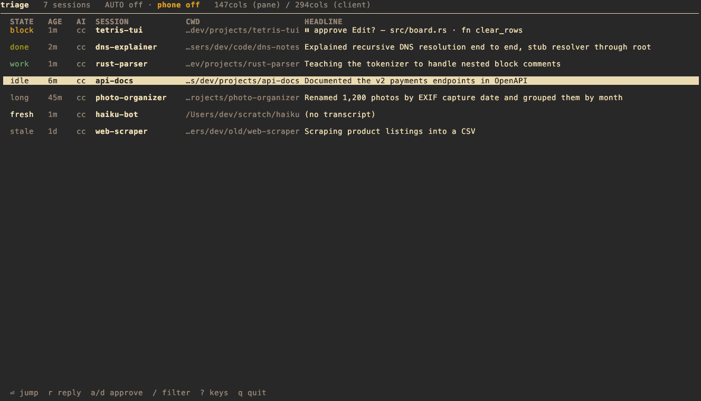

# triage

A Rust TUI to **triage parallel Claude Code and Codex CLI sessions across tmux panes** — sort by attention priority, optionally let a Sonnet auditor handle routine approvals so you don't babysit every prompt.

Reads files the agents already write:

Claude Code:
- `~/.claude/sessions/<pid>.json` — discovery + `idle`/`busy` status
- `~/.claude/projects/<encoded-cwd>/<sessionId>.jsonl` — recap, prompts, tool calls, per-message usage

Codex CLI:
- `~/.codex/sessions/**/rollout-*.jsonl` — prompts, messages, tool calls, token counts
- `~/.codex/state_5.sqlite` — native thread titles, agent labels, parent/child thread roots

Shared:
- `tmux list-panes -a` — joined via process-ancestor walk from the agent PID

Different shape from [`agentop`](https://crates.io/crates/agentop) (process-centric, token/cost focused). `triage` is content-centric: the headline column is the recap, the detail pane shows what the agent is doing and why, and auto mode (off by default) routes safe tool approvals through an LLM auditor.

## Demo



Sessions sorted by attention priority — `block` (needs you now) at the top, `stale` at the bottom — each row carrying the agent's own recap of what it's doing.

> The demo runs entirely on synthetic fixtures, not real sessions. To regenerate it, see [`scripts/demo/`](./scripts/demo/README.md): `scripts/demo/seed.sh` builds a sandboxed `$HOME` + idle tmux panes, then run `triage` and screenshot it (or record with asciinema for an animated version).

## Install

```bash
# Homebrew (macOS) — recommended; bundles the notification helper
brew install inkless/triage/triage

# crates.io — installs the `triage` binary (crate is named triage-tui)
cargo install triage-tui

# From source (development)
cargo install --path .
```

Then:

```bash
triage              # launch the TUI
triage --probe      # print the joined session table once (no TUI)
triage agents --json # list peer agents and guarded send status
triage send --to '%42' --message "can you check this?" # message a live agent
triage inbox        # peer mail queued for the calling agent
triage messages     # review peer mail across agents
triage hooks install # Claude + Codex peer-mail hooks (restart agents afterwards)
triage launch --cwd "$PWD" --provider codex # launch a new detached agent window
triage notify "..." # one-shot ntfy push using config.toml's [ntfy] block
triage cost         # daily/weekly Claude spend rollup across all transcripts
```

After reinstalling, restart any already-running `triage` TUI pane so it picks up the new binary and state-file behavior.

The `notify` subcommand lets any agent, hook, or shell script ping the user's phone without re-implementing ntfy auth:

```bash
triage notify "build green on PR #123"                   # positional
triage notify --title "deploy done" "all stage smoke ok" # title override
git log --oneline -3 | triage notify --title "shipped" - # stdin
```

Blocks until curl confirms the POST (5s timeout); exit status reflects the outcome. Requires an `[ntfy]` block in `~/.config/triage/config.toml` (see [Configuration](#configuration)).

The `agents` / `send` subcommands are for agent-to-agent coordination through
triage's existing tmux/session snapshot. When run from inside tmux, `agents`
omits the caller's own pane by default; pass `--include-self` for a full
inventory/debug view.

```bash
triage agents --json
triage send --to '%42' --message "Can you check whether your branch touched codex.rs?"
triage send --to '%42' --file /tmp/question.md
printf '%s\n' "short message" | triage send --to '%42' -
```

Agent messages derive their sender from the calling process’s tracked agent session, including its pane ID. Run `triage send` from the agent’s tool shell; unresolved or ambiguous identities are rejected. `--from` is no longer supported and `TRIAGE_AGENT` does not override identity. Do not add a sender prefix to the message body.

`send` recomputes a fresh snapshot, refuses ambiguous/no-pane/unknown targets,
and denies delivery when the target is on a visible Claude/Codex permission
prompt. Codex delivery also requires a readable, recognized composer with no
unsent text; drafts and uncertain composer layouts are refused. Working sessions
are allowed when the composer is clear; the receiving
agent's terminal may queue the submitted line until its next input slot. The
message body is pasted through an internal tmux buffer and submitted with a
separate Enter, so agents can use either one-line text or a file/stdin body
without caring about the transport.

### Peer mail

With `[send] mode = "mailbox"` (the default), `triage send` writes the message
to the target's mailbox under `~/.local/state/triage` instead of typing it into
the pane, so peer messages never show up as user prompts:

- **Claude** sessions are woken by a background `asyncRewake` hook that
  delivers the mail as a collapsed "Stop hook feedback" line; mail that arrives
  mid-turn is folded into the running turn.
- **Codex** sessions get the mail as hidden context on their next prompt. An
  idle Codex session is woken by a single queued line,
  `📨 triage: N peer message(s) from …`, sent once per burst.
- Targets without triage's hooks (started before `triage hooks install`, or
  not installed) get the message pasted as before, labelled as peer mail.

The delivered text names the sender and ends with a reply command,
`triage send --to <agent> --message "…"`. `--to` accepts a pane id, pane
target, name, agent id, or the agent id's last 8 characters; agent ids follow a
session through `/clear` and resume. Sending to yourself is an error (exit 2).

```bash
triage send --to 3f2a9c1d --message "rebased onto main" --wait   # block until delivered
triage send --to '%42' --mode legacy --message "..."              # force the old paste
triage inbox                 # read your queued mail by hand (marks it delivered)
triage inbox show <id>       # a long message whose head was delivered
triage messages --pending    # anything not yet delivered, across agents
triage messages --thread <a> <b> --follow
triage messages purge --older-than 30
```

`--wait[=SECS]` (default 60) exits 0 once delivered, 4 if the message bounced
(the target session ended first; the sender gets a short bounce notice), and 5
if it is still queued. Delivery is at least once: a message can be re-delivered
after a crash, and says so. A session only acts on peer mail it has context
for; agents launched for a coordinated fleet are told that peers may message
them.

`agents --json` reports `send_message_name` for a Claude session that
supports Claude Code's peer messaging: the session name its built-in
`SendMessage` resolves. This can differ from `name`, which an alias or tmux
window name replaces. When both the sender and the reader are Claude sessions,
the reply line of a delivered message offers that name next to the
`triage send` command. It is `null` for Codex sessions and for older Claude
versions, which only `triage send` can reach.

Codex runs tools in a sandbox that blocks process discovery and writes outside
the workspace, so `triage send` from a sandboxed Codex agent fails with
"Operation not permitted"; triage then says to rerun it with escalated
permissions.

Codex turns with no recorded agent/tool progress for 15 minutes appear as
`NoProgress` (`quiet` in the TUI, with “no progress Nm” in the headline).
`agents --json` includes `no_progress_seconds` and `pending_tool`. User input
and metadata updates do not reset the progress clock. A quiet turn can still
be doing legitimate work; this is not a dead-process diagnosis. `can_receive`
means the terminal accepts input, not that the agent has processed it.

To explicitly interrupt an eligible quiet Codex turn:

```bash
triage interrupt --to '%42' --dry-run
triage interrupt --to '%42'
```

The command rechecks session identity and progress, requires a readable pane,
and refuses permission prompts, unsent drafts, unfinished tool calls, live
task processes, or a transcript that changes during the checks. Recognized sleeping
startup services (Codex code-mode host and the supported memory-bank, Playwright,
and Salesforce MCP launch chains) may remain: they must start within 30 seconds
of Codex and predate its last recorded progress. Every descendant is checked;
new services, unknown commands, and browser/task children still block interruption. It sends one
Escape and records the action in the message audit. There is no atomic lock
with the receiving agent, so progress can resume after the final check.
Interruption does not guarantee queued input is processed; inspect the agent
again before using normal `send` for an urgent follow-up. `send` never interrupts.

`launch` is the reusable tmux/process primitive behind the TUI's `N` shortcut
and future mb-work fleet launch integration:

```bash
triage launch --cwd /path/to/repo --provider claude --window-name agent-TRI-114
triage launch --cwd /path/to/repo --provider claude \
  --append-system-prompt /tmp/system-prompt.md \
  --after-boot "Please pick up TRI-114 and report status through triage send."
triage launch --cwd /path/to/repo --provider codex --command "codex --model gpt-5"
```

The CLI form creates the new tmux window detached and prints the launched pane
id. `--provider` selects the configured default command (`claude` or `codex`);
`--command` overrides it and can infer the provider when omitted.
`--append-system-prompt` is applied only for Claude by expanding the file
contents at launch time, while Codex ignores it. `--after-boot` waits for the
agent shell to settle, presses Enter once, then pastes and submits the text via
the same tmux buffer path used by `triage send`.

`cargo build` auto-builds the macOS notification helper (`triage-notify.app`) under `scripts/triage-notify/` via `build.rs`, then stages a copy to `~/.config/triage/triage-notify.app`. The staged location is what the cargo-installed binary at `~/.cargo/bin/triage` finds at runtime — without it, notifications fall back to `osascript` which shows a "Show" button that routes to Script Editor. Build manually if needed:

```bash
bash scripts/triage-notify/build.sh
```

Requires Xcode CLI tools (`xcode-select --install`) for `swiftc`. The `.app` is intentionally not committed; it's regenerated locally.

## tmux bindings (recommended split)

```
# Desktop: switch to the long-lived triage pane (preserves multi-pane layout).
bind-key -n M-t run-shell "triage --jump-to-self"

# Mobile / SSH on phone: switch to the long-lived triage pane AND zoom it.
bind-key -n M-p run-shell "triage --jump-to-self --zoom"
```

**Desktop (`M-t`)**: jumps to the triage pane in your existing layout. Inside triage, `Enter` does a normal `switch-client + select-pane` to the target — no zoom, your multi-pane layout stays intact.

**Mobile (`M-p`)**: jumps to the triage pane *and* `tmux resize-pane -Z`s it so triage fills the phone screen. Inside triage, `Enter` jumps to the target pane *and* zooms it (auto-detected — see below). Net effect: every M-p leaves you on a full-screen pane; the gesture toggles between "triage zoomed" and "current session zoomed." Ctrl-b z to un-zoom and see the multi-pane layout. (Letters pass Alt cleanly across mobile terminals; symbols like `/` often don't on iOS, hence M-p over M-/.)

**Zoom-on-Enter is auto-detected** by triage's current pane width. Tmux resizes panes to the smallest attached client, so when you're on a phone the pane is narrow (<100 cols) → Enter zooms; when on desktop it's wide → Enter doesn't zoom. No flag needed, no per-device launch dance. If you want to force zoom on a wider pane, pass `--zoom-on-jump`. `--exit-on-jump` (popup pattern, exits triage after Enter) implies zoom too.

## Optional: hooks

Peer mail (see [Peer mail](#peer-mail)) needs triage's messaging hooks:

```bash
triage hooks install           # Claude (~/.claude/settings.json) and Codex (~/.codex/hooks.json)
triage hooks install --midturn # also deliver between tool calls, not just at turn boundaries
triage hooks status            # entries, and which live sessions are hook-capable
triage hooks uninstall
```

Agents read hooks at startup, so restart running sessions afterwards; until
then they keep receiving pasted messages. Codex asks you to trust new hooks the
first time they run. Install is idempotent, leaves other tools' hooks alone,
keeps five timestamped backups, and refuses to edit a settings file whose shape
it doesn't recognize.

Install the PreToolUse hook so Claude manual `a`/`d` and auto-mode verdicts route through Claude's clean approval channel instead of tmux send-keys:

```bash
triage --install-hooks         # same as: triage hooks install --approval
triage --install-hooks --dry-run   # preview
triage --uninstall-hooks       # remove
```

## Keys

The main header shows behavior-changing modes persistently, e.g.
`AUTO on · phone off`. Auto mode includes the in-flight auditor count as
`AUTO on · N audits` while auditor workers are running.

```
General:
  ↑↓ / j k         move selection
  gg / G           jump to top / bottom
  ⏎                jump to selected session's tmux pane
  space            toggle detail panel
  p                toggle live preview of the selected pane — updates as you navigate
  >                flip preview between right (compact table) and bottom (full table)
  ?                show all keybindings
  q / Ctrl-C       quit

Approve / deny / mute / watch:
  a                approve (selected session must be paused on a permission prompt)
  d                deny
  A                toggle autonomous mode (off → on)
  P                toggle ntfy phone push (on by default; Mac banners unaffected)
  r                reply to selected agent with a one-line user message
  m                mute / unmute selected session
  w                watch / unwatch selected session — sticky; fires a "finished" banner on every work → done transition until toggled off
  N                pick a known cwd and launch a new configured agent in a new tmux window

Filter & overlays:
  /                start filter (matches name + cwd, case-insensitive)
                   in edit mode: type to filter · ↑↓ navigate · ⏎ jump to selection
                                 Esc clear · ^W delete word · ^U clear line
  R                rename selected row in triage only; ^U clears the old value while editing
  l                open / close audit-log overlay (auto-mode decision history); H also works
  $                open / close cost overlay (cross-session spend rollup)
  M                open / close peer-mail overlay: conversations between agents
                   j k choose · ^d/^u scroll · p pending only · a this agent / all
                   ⏎ jump to the other agent · Esc close

Overlay navigation (H / $):
  j k / ↑↓         scroll one line
  ^d / ^u          half-page
  gg               jump to top
  G                jump to bottom
  Esc              close
```

## Preview and reply

Toggle preview with `p`. Triage captures the selected tmux pane's visible
screen and renders it beside the table on wide terminals, or below the table on
narrow terminals. The preview follows selection as you navigate. Press `>` to
flip between right-docked and bottom-docked preview.

Press `r` to compose a one-line reply to the selected agent. When preview is
open, the composer appears inside the preview panel so the target pane and the
outgoing message stay together. When preview is closed, triage shows a yellow
compose bar above the footer. `Enter` sends via `triage send`'s tmux buffer
path; `Esc` cancels.

## Attention states

Default sort order, highest-attention first:

| State | Meaning |
| --- | --- |
| `error` | Last `stop_hook_summary` reported errors. |
| `block` | Paused on a permission prompt (or `status=busy` + no events for 90s). |
| `done` | `Stop` within last 3 min — awaiting next prompt. |
| `work` | `status=busy` and progressing. |
| `idle` | `Stop` >3 min and <30 min ago. |
| `long` | `Stop` >30 min ago. |
| `fresh` | No user prompts seen yet. |
| `stale` | No transcript activity >24h. |
| `?` | Indeterminate. |

## Detail pane

Toggle with `space`. Three zones:

- **Header** — `state · pane · model (1M) · uptime`.
- **Body** — agent's latest text (Claude's reasoning, often the *why* before the next tool call), pending tool + full input, recap (`away_summary`), last user prompt.
- **Stats footer** — auditor decision (when auto mode is on, with cost + duration), peer mail for this agent (`✉ N pending / M`; `M` opens it), session cost + tokens + context-window % (yellow ≥80%, red ≥95%), event timing.

## Codex support

Codex sessions show up beside Claude rows with the `cx` provider label. Filter matches `cx`, `codex`, row name, and cwd.

Triage discovers live Codex processes from `ps`, finds the active rollout jsonl held open by the process, and joins that process back to tmux. Titles come from Codex's native thread metadata when available. `R` creates a triage-local alias when the native title is too long; aliases are keyed by Codex's root thread id, so a renamed spawned-review session continues to label the parent row.

Blocked Codex detection uses two signals together: the latest unfinished tool call must request escalation, and the visible tmux pane must show Codex's approval UI. Manual `a`/`d` and auto mode answer that visible prompt through tmux. Codex does not currently have a PreToolUse hook path like Claude, so triage validates the prompt is still present before sending keys; approve requires the `Yes` option to be selected.

Known limits:

- The `$` overlay shows live Codex token/context usage, but Codex dollar cost is unavailable from local data.
- The `triage cost` CLI command is still Claude-dollar based.
- Codex approval routing depends on the visible native prompt, so it can only answer the live tmux pane.
- Restart old triage panes after `cargo install --path .`; an already-running TUI keeps its old binary and in-memory state.

## Auto mode

Toggle with `A`. Off by default; persists across restart.

When on, each refresh spawns `claude -p --model claude-sonnet-4-6 --tools "" --name triage-auditor` for any Blocked Claude or Codex session with a captured tool request. The auditor is Claude Sonnet for both providers; triage does not spawn Codex as the reviewer. The auditor receives the session's recent recap + intent + tool + full tool input and returns `APPROVE` / `DENY` / `WAIT` with a one-line reason.

- `APPROVE` / `DENY` route through the same machinery as manual `a`/`d` (Claude hook decision file when available, tmux send-keys fallback; Codex visible-prompt routing).
- `WAIT` surfaces the reason in the detail pane and leaves the prompt for human review.
- Claude `AskUserQuestion` prompts never enter the auditor; semantic choices are always left for direct human review.

Notifications are deferred while an audit is actually running. `APPROVE` and
`DENY` stay quiet; `WAIT` (including auditor or routing failures) sends a
desktop banner plus phone push when enabled. A Blocked session with no
auditable request alerts immediately, as do Error transitions. Starting or
restarting triage silently baselines existing rows instead of replaying alerts.

Decisions append to `~/.config/triage/auto-decisions.jsonl` (one JSON object per line, includes cost + duration). Press `l` (or `H`) for the audit-history overlay.

**Safety**: the prompt explicitly approves routine repo work (Read/Glob/Grep, builds, tests, git ops, `gh pr create/edit`, file edits in the repo) plus Jira issue creation and status transitions. It denies destructive actions (`rm -rf`, force-push to main, dropping data, `sudo`, shared-infrastructure writes), and WAITs when the action itself is in a middle zone — unfamiliar API, unreadable Bash flags, paths outside the repo. Customize via `~/.config/triage/auditor-prompt.md` (or `$TRIAGE_AUDITOR_PROMPT_FILE`).

Per-call budget is `--max-budget-usd 1.00`. Typical Sonnet round-trip: 10–25s and \$0.02–0.05 per audit.

## Hook setup (optional)

For Claude, `a`/`d` in `hook` mode and auto mode both deliver decisions through a PreToolUse hook. The hook is a small bash script embedded in the binary; `--install-hooks` writes it to `~/.config/triage/hooks/triage-preuse.sh` and merges the path into `~/.claude/settings.json`. No source-repo dependency — `cargo install triage` users can delete their checkout and the hook keeps working.

```bash
triage --install-hooks         # idempotent install (also re-installs an updated hook on triage upgrade)
triage --install-hooks --dry-run   # preview both the file write and the JSON merge
triage --uninstall-hooks       # remove from settings.json + delete the script file
```

The hook is zero-cost when triage isn't running (single file-existence check + `kill -0`, ~3ms). With auto mode on, it waits up to 60s (vs the default 3s) for the auditor's verdict via a claim-file handshake. Re-running `--install-hooks` after a triage upgrade refreshes the on-disk script if its content changed.

Without the hook installed, `h` falls back to `tmux` mode which sends keystrokes to Claude's pane — works regardless of managed-policy settings. Codex approval routing always uses the tmux path; triage's Codex hooks only deliver peer mail.

## Cost & context-window tracking

Detail pane shows approximate Claude session cost (per-message `usage` × per-model rates, deduplicated by `message.id`) and context-window occupancy as `current / total (%)`. Codex sessions show token usage and context occupancy, but not dollars.

Context-window detection precedence:

1. `TRIAGE_CONTEXT_WINDOW` env var (explicit override, e.g. `1000000`)
2. Session's own `model` carries `[1m]`
3. `~/.claude/settings.json` `"model"` field has `[1m]` (e.g. `"opus[1m]"`) — the deterministic global signal
4. Per-session peak input tokens >210k → 1M
5. Fleet-wide peak >210k → 1M (any sibling session's evidence)
6. Default 200k

Cost figures are approximate; cross-check Claude rows against `/cost` for the canonical per-session total. Codex local rollouts expose token counts, cached input tokens, and context windows, but not billable dollars.

## Configuration

Hand-editable TOML at `~/.config/triage/config.toml`. All sections + fields are optional — an empty file (or no file) is valid. Loaded once at startup; restart triage to pick up changes.

```toml
# Phone push notifications via self-hosted ntfy. See
# memory-bank/projects/triage/specs/notify-self-host.md for the homelab setup.
[ntfy]
url   = "https://ntfy.guangda.me/triage-alerts"
user  = "triage"
token = "..."

[thresholds]
mobile_width    = 140    # cols — auto-zoom-on-jump fires below this
refresh_seconds = 2      # polling fallback when fs events are quiet

[notifications]
terminal_bundle = "net.kovidgoyal.kitty"   # override click-to-jump sender

[model]
context_window = 1000000   # bypass auto-detect (use the 1M window)

[approval]
mode = "hook"  # "hook" or "tmux"; Claude only. Codex approvals always use tmux.

[send]
mode = "mailbox"        # "mailbox" (default) or "legacy" (paste into the pane)
pointer_grace_secs = 3  # how long Codex mail waits for the next prompt before a wake line
retention_days = 30     # `triage messages purge` default; the TUI applies it daily

[new_agent]
provider = "claude"   # "claude" or "codex"; defaults to claude
command = "claude"    # optional override; provider default is "claude" / "codex"
window_name = "agent-{provider}-{cwd_basename}"
```

Pressing `N` in the TUI opens a cwd picker built from current triage sessions,
then runs the same launch path in a new attached tmux window with `-c <cwd>`.
If there are no sessions yet, the picker offers `$HOME`.

**Security**: `chmod 600 ~/.config/triage/config.toml`. Triage refuses to load and warns if perms allow group/other read — the `[ntfy].token` field would otherwise be leakable. Every section then falls back to its default, including `[send]`.

The auditor system prompt lives separately at `~/.config/triage/auditor-prompt.md` (markdown, easier to hand-edit than embedded TOML strings). Empty/missing falls through to the compiled-in default.

## Design notes

- **Discovery + tmux join.** Claude uses sessions JSON keyed by PID; Codex uses live process file handles into rollout jsonl files. Tmux's `pane_pid` is usually the shell, so triage walks the process tree upward until an ancestor matches a `pane_pid`.
- **Transcript pairing.** Claude's active pane gets the jsonl with the newest qualifying user-text; remaining sessions pair greedily by mtime. Survives `/clear`. Codex rollouts are discovered from the live process directly.
- **Mechanical extraction in the live path.** Claude recap is `away_summary`; Codex uses the latest rollout messages and native thread title metadata. The auditor is opt-in and runs only on Blocked sessions.
- **Hook is optional.** Triage works without any `~/.claude/settings.json` edits — the hook is needed only for clean Claude approve/deny + auto-mode decision delivery.

## Status

`v0.2-dev` — local single-machine, macOS-tested. Auto mode + per-session cost + context-window % + audit-log overlay shipped. Not yet on crates.io.

## Stack

`ratatui` 0.30 + `crossterm` 0.29 + `notify` 8.2 + `serde_json` + `libc`. Rust edition 2024.

## License

MIT OR Apache-2.0
